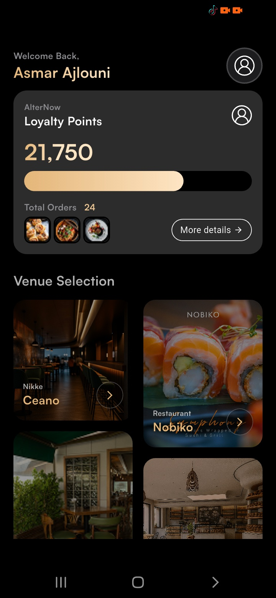
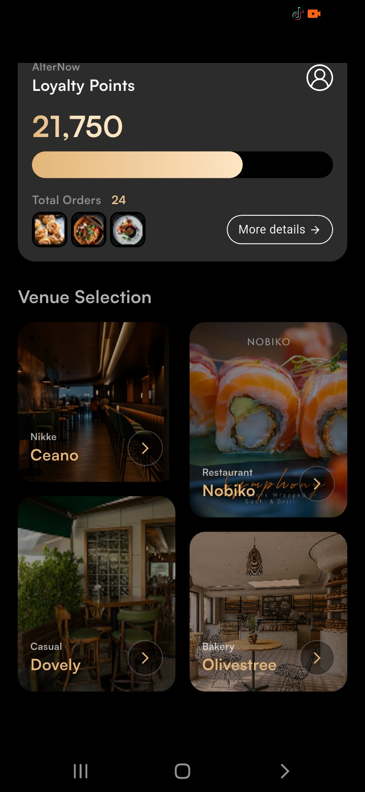
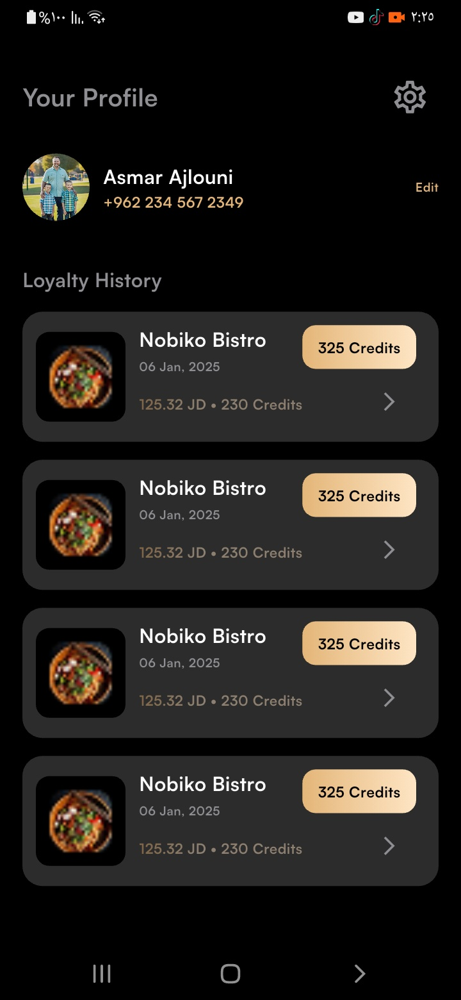

# Flutter UI Technical Assessment

This project is a Flutter implementation of a mobile application page based on a provided Figma design.  
The objective of this task was to accurately translate the high-fidelity UI design into clean, structured, and maintainable Flutter code while following best practices for widget composition and UI architecture.

---

## 📱 Project Overview

The application recreates the UI layout from the provided design and focuses on:

- Clean widget composition
- Responsive layout
- Dynamic data rendering from a local model
- Reusable UI components
- Maintainable and structured Flutter code

The page displays a collection of venues using a masonry grid layout where each card is dynamically generated from a local data model instead of being hard-coded.

---

## ✨ Features

- Responsive UI layout
- Masonry Grid layout using `flutter_staggered_grid_view`
- Dynamic data rendering using local models
- Reusable widgets
- Clean and maintainable code structure
- Accurate spacing and styling based on the Figma design
- Organized Flutter widget hierarchy

---

## 🏗 Project Structure

The project follows a modular structure to keep the code clean and scalable.

```
lib
│
├── core
│   └── utils
│
├── feature
│   └── home
│       ├── data
│       │   └── models
│       │
│       ├── presentation
│       │   ├── views
│       │   └── widgets
```

### Explanation

- **Models** → Represent the data used to build the UI  
- **Widgets** → Reusable UI components such as cards and UI elements  
- **Views** → Main screens of the application

---
<h2>📸 App Screenshots</h2>

<p align="center">
  
  
  
</p>

<p align="center">
  
  
  
</p>
---

## 🚀 How to Run the Project

1. Clone the repository

```
git clone https://github.com/your-username/flutter-ui-technical-task.git
```

2. Navigate to the project folder

```
cd flutter-ui-technical-task
```

3. Install dependencies

```
flutter pub get
```

4. Run the application

```
flutter run
```

---

## 🛠 Technologies Used

- Flutter
- Dart
- Material UI
- flutter_staggered_grid_view

---

## 👩‍💻 Author

Toka Ahmed  
Flutter Developer